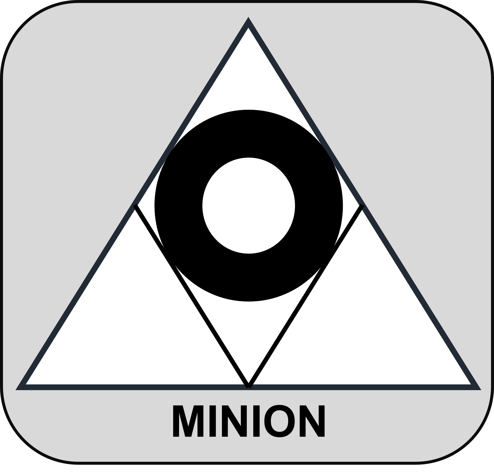

# Minion: Derivative-Free Optimization Library

<div align="center">
  
</div>


[](https://minion-py.readthedocs.io/en/latest/)

**Minion** is a high-performance **derivative-free optimization** library designed for solving complex optimization problems where gradients are unavailable or unreliable. It features **state-of-the-art evolutionary algorithms**, including top-performing methods from IEEE CEC competitions, which are not commonly available in standard optimization libraries such as SciPy, NLopt, OptimLib, pyGMO, and pagmo2.

Minion also serves as a **research platform** for developing and testing new optimization algorithms. It includes benchmark functions from **CEC competitions (2011, 2014, 2017, 2019, 2020, and 2022)**, providing a robust framework for algorithm evaluation and comparison.

## 🔥 Why Minion?
- **Includes state-of-the-art optimization algorithms**  
  - Features **JADE, L-SHADE (1st place, CEC2014), jSO (1st place, CEC2017), j2020 (3rd place, CEC2020), NL-SHADE-RSP (1st place, CEC2021), LSRTDE (1st place, CEC2024)**, and **ARRDE** (our own novel Adaptive Restart-Refine DE algorithm). 
- **Parallelization-ready**  
  - Designed for **vectorized function evaluations**, allowing seamless integration with **multithreading and multiprocessing** for high-performance optimization.  
- **Optimized C++ backend with a Python wrapper**  
  - High efficiency with an easy-to-use Python API.  
- **CEC Benchmark Suite**  
  - Supports CEC benchmark problems from **2011, 2014, 2017, 2019, 2020, and 2022** for rigorous testing.

## 🚀 Installation
Minion’s Python wrapper (**minionpy**) is available on PyPI:

```sh
pip install minionpy
```

To compile the C++ version, refer to the Minion documentation.

## 📖 Documentation

For comprehensive instructions on usage, API reference, and detailed examples, please visit the official documentation:

- **[Minion Documentation](#)**  
  *Explore detailed guides, tutorials, and examples on [ReadTheDocs](https://minion-py.readthedocs.io/).*


